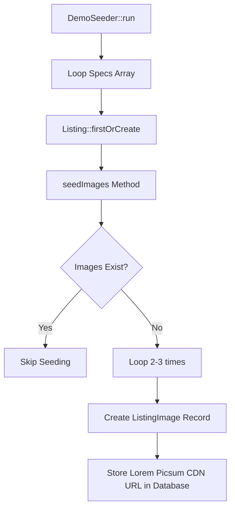

# Product Images Seeding Analysis Report

This report analyzes how product seeders and listing images are currently structured in the Laravel marketplace application.

## 1. Flow Diagram

## 2. Analysis of Existing Implementation

### 1. Seeder(s) Creating Listing/Product Data
- **`Database\Seeders\DemoSeeder.php`**: The `run()` method contains a hardcoded array `$specs` representing 10 active product listings across three categories (*Phones*, *Furniture*, and *Clothing*). It inserts these records using `Listing::firstOrCreate()`.

### 2. Seeder(s) Assigning Product Images
- **`Database\Seeders\DemoSeeder.php`**: Handled via the private `seedImages(Listing $listing)` helper method called during listing creation.

### 3. Image URL Generation
- **Placeholder Service (Picsum)**: The image URLs are generated dynamically using the public placeholder image CDN **Lorem Picsum** (via `https://picsum.photos`).
- **Generation Logic**:
  `'url' => 'https://picsum.photos/seed/' . $listing->id . '-' . $i . '/800/800'`
  This maps to a deterministic random image based on the listing ID and image loop index.

### 4. Image Storage Location
- **External CDN (Database URL)**: The images are **not** stored locally in `storage/app/`, `public/storage/`, or `public/images/`. The `listing_images` table stores the external HTTP URL. The browser fetches the image dynamically from the Picsum server at load time.

### 5. Models Involved
- `App\Models\Listing` (for the listing product metadata)
- `App\Models\ListingImage` (representing the `listing_images` table, containing the URLs)
- `App\Models\Category` (to assign categories)
- `App\Models\User` (to link the seller)

### 6. Factories Involved
- **None**: Product listings and images do not use factories; they are manually defined and inserted via Eloquent.

### 7. Root Cause of Mismatched Images
- Picsum Photos is a generic placeholder image service that returns random photos (like landscapes, office rooms, or general portraits) based on a numeric seed value. It has **no semantic intelligence** or search capabilities for query strings. Thus, a seed like `1-0` (iPhone) or `5-1` (Eames Chair) returns random photographs that do not match the product names.

## 3. Files Involved
*   **[`database/seeders/DemoSeeder.php`](file:///Users/donaldmethus/Sites/chat-marketing-app/database/seeders/DemoSeeder.php)**
*   **[`app/Models/Listing.php`](file:///Users/donaldmethus/Sites/chat-marketing-app/app/Models/Listing.php)**
*   **[`app/Models/ListingImage.php`](file:///Users/donaldmethus/Sites/chat-marketing-app/app/Models/ListingImage.php)**

## 4. Recommended Approach to Safely Replace Product Images
To replace the random placeholder images with realistic, product-matching images without breaking any existing order, chat, or category relationships:

1.  **Do NOT delete the Listing records**: Deleting and recreating listings will generate new Listing IDs, which will break database foreign key constraints on the `orders`, `conversations`, and `messages` tables.
2.  **Use a Dedicated Image Update Script/Seeder**: Create a new seeder, e.g. `ProductImagePolishSeeder.php` or a migration that:
    - Queries all listings in the database: `Listing::all()`.
    - Matches each listing title with a curated, themed image URL (e.g. public Unsplash URLs for iPhones, sideboards, leather jackets, etc.).
    - Deletes only the existing `ListingImage` records for that listing and creates new ones with the curated URLs, or simply updates the `url` column in the `listing_images` table for the matching records.
    - Saves changes to the database.
3.  **Result**: Listing IDs and relations remain 100% untouched, ensuring that the React Native app, admin panel logs, buyer orders, and chat threads remain fully compatible and functional.
